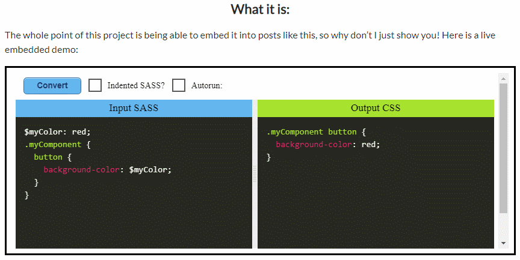

# Sass-Embed
An experimental attempt at creating an embeddable SASS-to-CSS playground, which can be dynamically generated and modified with custom settings and preloaded SASS input. The main point is the ability to change the input SASS and re-compile right in the embed.



If you just want to show SASS/SCSS side-by-side with CSS, check out the [alternatives](#alternatives) section at the bottom.

## Project Write-up and demos
Project Writeup and demos: [https://joshuatz.com/projects/web-stuff/sass-embed-dynamic-embeddable-sass-scss-to-css-playground](https://joshuatz.com/projects/web-stuff/sass-embed-dynamic-embeddable-sass-scss-to-css-playground)

JSFiddle demo: [link](https://fiddle.jshell.net/joshuatz/n3ce6204/show/light/?sassString=%24myColor%3A%20red%3B%0A.myComponent%20%7B%0A%20%20%20%20button%20%7B%0A%20%20%20%20%20%20%20%20background-color%3A%20%24myColor%3B%0A%20%20%20%20%7D%0A%7D&autorun=true)

---

## How to use
At it's simplest, here is how to use it:
 1. Host the actual sass-embed files somewhere
 2. Plug the hosted URL into `embed-gen.html` and configure to your liking
     - You can preload with SASS/SCSS
     - You can turn `autorun` on/off
     - You can set the input to `readonly`
 3. Copy one of the embed codes
     - You can either use an iframe where the SASS is loaded via querystring
         - Or
     - An iframe + sass loaded by postMessage to iframe (this avoids super long querystrings, and lets you swap out content dynamically from the parent page)

See relevant sections below for more details.

### Embed-Gen
You can use `embed-gen.html` to generate the final embed code. It looks like this:


Simply plug in your options, and where the Sass-Embed files are hosted, and it will generate all the variations of the embed code for you. You can open the file in your browser, or if you want a hosted version, see [this](https://joshuatz.com/static-for-wp-iframes/sass-embed/embed-gen.html).

Simply put, it automates writing the embed code to handle the below sections (configuration and loading in SASS)

### Configuration Parameters
Query Key | postMessage Key | Description
--- | --- | ---
`autorun` | NA | *Option*: If SASS should be continuously converted as user types in SASS input area.<br><br>Use "true" or "false" string for query key.
`readonly` | NA | *Option*: If input SASS panel should be set to readonly mode
`sassString` | `sassString` | The literal string of SASS to convert to CSS
`indented` | `indented` | If the SASS input is original indented syntax, or SCSS flavor.<br><br>Use boolean in postMessage, use "true"|"false" string in query key.

### Different ways to load in SASS
You can load in SASS in several different ways. The list below is in order of precedence, so inputs higher up will override those lower down
 - postMessage
 - querystring
 - inline tag (placed within `index.html`):
    ```html
    <pre class="language-scss input" style="display:none;">
    body {
        div {
            background-color: green;
        }
    }
    </pre>
    ```

---

## Hosting
You can easily host sass-embed on your own domain - simply throw the three main files (`index.html`, `script.js`, and `style.css`) into a public folder on your server.

Alternatively, you can actually copy the code into a JSFiddle and serve it that way. That is actually why there is a bunch of strange code in my source that checks whether or not it is running in JSFiddle or not.

My JSFiddle hosted embed (subject to change): [https://fiddle.jshell.net/joshuatz/n3ce6204/show/light/](https://fiddle.jshell.net/joshuatz/n3ce6204/show/light/)

----

## Alternatives
See the [project writeup](https://joshuatz.com/projects/web-stuff/sass-embed-dynamic-embeddable-sass-scss-to-css-playground) for more details, but to put it briefly, if you don't need your embeds to be "interactive", you can use JSFiddle or CodePen to display SCSS/SASS side-by-side. [Demo](https://codepen.io/joshuatz/embed/rNBeyaW/?height=265&amp;theme-id=0&amp;default-tab=css,result)

Simply clone one of these and paste your SASS into it, then save and use the embed option:
 - [CodePen](https://jsfiddle.net/joshuatz/xe2pnoat/)
 - [JSFiddle](https://codepen.io/joshuatz/pen/rNBeyaW)